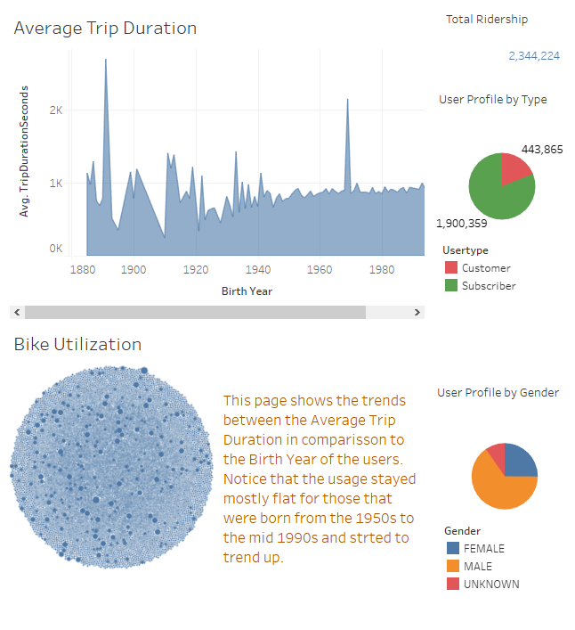
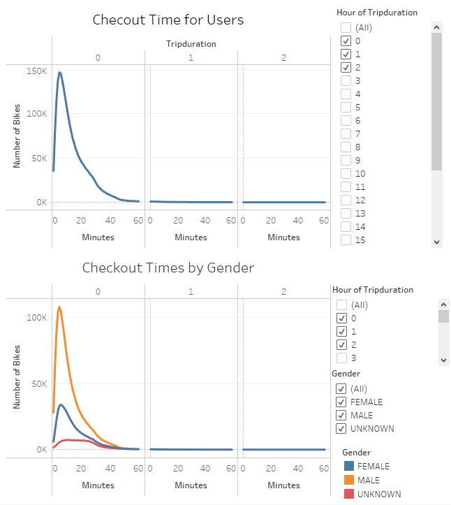
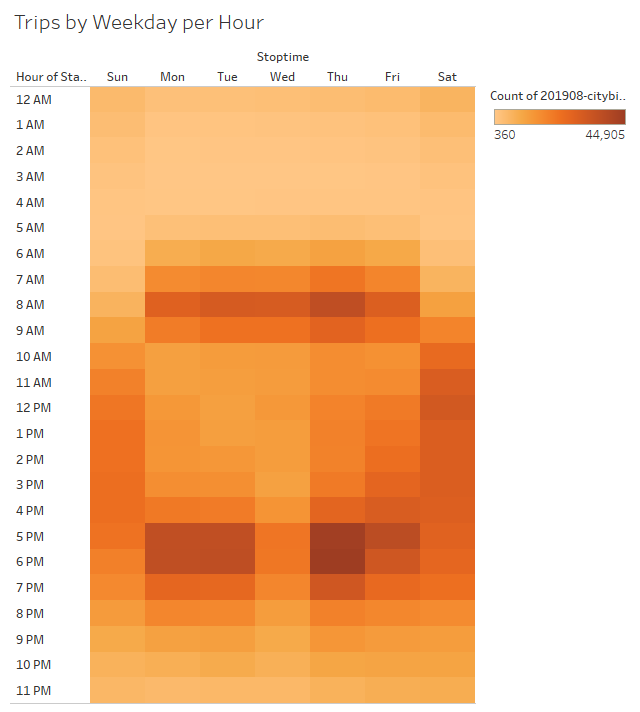
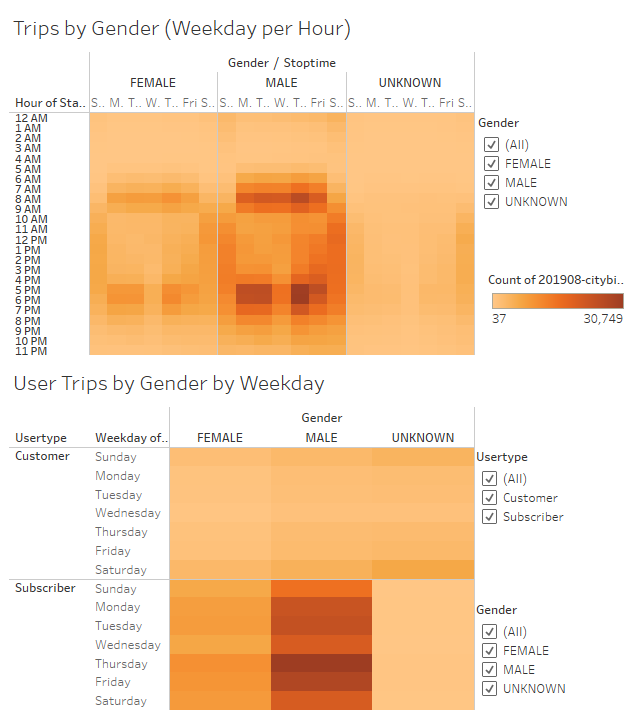

# NYC Bike Sharing Analysis

## Overview of Analysis
I preparation of establishing a bike sharing program in Des Moines, Iowa the city officials tasked us with the presentation of similar program data. We used the NYC bike sharing program as a seed. The following analysis is of the NYC Citi Bike program, specifically the August 2019 usage data. The hope is that the findings can be applied to establishing a bike sharing program within the city of Des Moines.

## Results of Analysis
Several aspects of the dataset were analized for usage of the citi bikes. Tableau was used to prepare the data visualization that were set to tell a story. The aspects in the analysis are as follows.

### Ridership Profile, Trip Duration and Bike Utilization
For this set of analysis produced five visualizations. Legends are displayed as needed for better presentation.
- **Total Ridership:** A count of all the usage records within the month of August 2019.
- **User Profile by Type:** The user profile is separated into the two types Customer and Subscriber. A customer is one that has a 24hr or seven-day pass where a subscriber is defined as someone that has an annual membership.
- **User Profile by Gender:** The same user data from the above data is sliced by the gender as recorded in the user profile.
- **Average Trip Duration:** The average trip duration is based on the length of the bike rental categorized by the birth year of the user.
- **Bike Utilization:** Bike utilization is the simple metric of how many times a particular bike was used during the month of August 2019. In this visualization, a larger diameter indicates a higher usage.

### Usage Data by Duration and Gender
There are two charts displayed within this section. The first charts display the number of bikes that were used by the duration of the rental period. We can clearly see that the peek duration for rental period is around six minutes, regardless of the gender.

### Number of Trips Taken by Weekday and by Hour
This data is in the form of a heat map that displays the bike usage as color density where the darker color means high usage. It can be noted that there is higher usage between the hours of 6:00AM - 9:00AM and 4:00PM - 8:00PM during the weekdays. It is also seen that during the weekend the usage stays consistent during the daylight hours.

### Usage by Day of Week, Gender and User Type
There are two heat map displays in this category.
- **Trips by Gender (Weekday per Hour):** This chart displays the number of trips taken by users sliced by gender and the day of week. Again, as with the previous display we can summarize that the peak usage times during the week are as seen before. It seems that male user count is much higher than of that of the female users.
- **User Trips by Gender by Weekday by User Type:** In this graphic the data is displayed to show the gender specific usage. Also, it displays the usage differences between the Customer and Subscriber user groups.

## Summary
The data shows that the ridership is dependent on the Age, Gender, User Type, Day of the Week and Time of Day. Roughly speaking there are over 75,000 rides that are accounted in a single day. Vast majority of the rides are done during the week between the hours of 6:00AM - 9:00AM and 4:00PM - 8:00PM. Also, it is seen that the majority riders are male and are annual subscribers of the service. Another piece of information that is gleaned from the data is that most of the rides are about six minutes in duration for male and female riders. For those riders that did not specify a gender the ride duration is about eight to 25 minutes. It is also seen that the younger riders are more inclined to use the bike share.

Things to consider prior to implementing the program in Des Moines...
- Ridership dependency on tourism. It would be prudent to look at specially the user type of Customer to learn the percentage of residents vs visitors that utilizes the bike sharing program short term.
- Ridership dependency on user age. More study should be lent to understand the age distributions of the possible riders between the two cities of New York and Des Moines.

The visualizations used in this analysis can be found at this link to the [Tableau Dashboard](https://public.tableau.com/app/profile/lasitha.liyanage/viz/NYCBikeUseAnAnalysisbyLOL/BikeUsageAnalysisNYC?publish=yes)